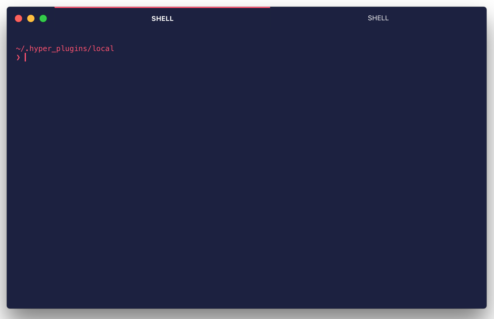

# hyper-midnight

> Minimalist midnight theme for [Hyper](http://hyper.is/).




# Install

1. Open Hyper preferences(`~/.hyper.js`)
2. Add `hyper-midnight` to the plugins list:

```
...

plugins: [
  'hyper-midnight'
],

...

```

# More customizations

Here are other plugins to make your terminal look just like mine:

- [pure](https://github.com/sindresorhus/pure)
- [hyperline](https://github.com/Hyperline/hyperline)
- [hyperblinks](https://www.npmjs.com/package/hyperlinks)


# Acknowledgement
[zpnk](https://github.com/zpnk) for [Monochrome
theme](https://github.com/zpnk/hyper-apex)

# License MIT
